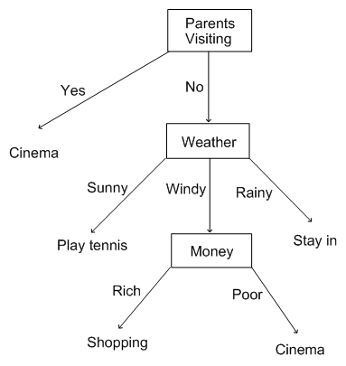

# JavaScript Logic & Conditionals

## SWBAT

- Understand the difference between `==` and `===`
- Identify boolean operators
- Understand what is meant by "truthy" and "falsy"
- Confidently write if/else statements
- Use the ternary operator

------

### Self Assessment

* **Fizz-Buzz**
  *  For each number from `1` to `100`  print the following: `fizz` if it is a multiple of `3`, `buzz` if it is a multiple of `5`, and `fizzbuzz` if it is a multiple of both.
  
-----

Did anyone use the "&&" operator?

### Comparison Operation

Equality comparisons can be made with `==` (loose equality) or `===` (strict equality). What's the difference?

From [MDN](https://developer.mozilla.org/en-US/docs/Web/JavaScript/Equality_comparisons_and_sameness):
> Briefly, double equals will perform a type conversion when comparing two things; triple equals will do the same comparison without type conversion (by simply always returning false if the types differ).

So, that means that `1=="1"` will evaluate to `true`, but `1==="1"` will evaluate to `false`. Check it out for yourself in the Chrome console!

From the same [MDN page]():
> Strict equality is almost always the correct comparison operation to use.

and
  
> Some developers consider that it is pretty much never a good idea to use loose equality. The result of a comparison using strict equality is easier to predict, and as no type coercion takes place the evaluation may be faster.

### Logical Operators

There are three types of operators that work with booleans:

* **AND**, denoted `&&` 
* **OR**, denoted `||`
* **NOT**, denoted `!`

When used in a statement, all of these return either true or false.

We'll look at the **NOT** operator in more detail later. For now, let's focus on **AND**, **OR**, and comparison.

```javascript
3 > 1 && 10 > 1

100 > 200 || 2 > 1

5 === 5

```

[MDN Logical Operators](https://developer.mozilla.org/en-US/docs/Web/JavaScript/Reference/Operators/Logical_Operators)

So what will these return?

```javascript
"hello" === 'hello'
5 === 5
true === false
null === null
undefined === undefined

var a = ["UCLA", "USC"] 
var b = ["UCLA", "USC"]
a === b

var x = {name: "Godzilla"}
var y = {name: "Godzilla"}
x === y
```

...JUST when I thought I understood JavaScript.


The second set of examples fail because both **arrays** and **object literals** are *complex* objects, and not just simple values like strings, numbers, and booleans. Objects can be complex collections of values in memory that we are referring to in a program, so to simplify things, we only store each object as an id, and it is this id in memory that then points to all the data about the object.

However, that means when we go to compare the two objects we don't care if they point to the same collections. We only compare their respective ids when checking for equality, and each object or array represents a new object with its own unique id.

If we want to compare arrays, we can convert them to strings first.

```javascript
[1,2,3].toString() == [1,2,3].toString()
```

----

#### True and false, truthy and falsy

In javascript, "true" and "false" are easy to understand. They are exactly what they say they are.

But JavaScript (and most languages) also allow a lot of other things to *evaluate* to true, if we test them. 


```javascript
if(2 > 1){
    console.log("The condition evaluated to true")
}
```

```javascript
if(true){
    console.log("The condition evaluated to true")
}
```


Let's try plugging a few others into an if statement:

```javascript
false
1
0 (zero)
-1
"" (empty string)
[] (empty array)
{} (empty object)
null
undefined
NaN (a special Number value meaning Not-a-Number!)
```

### Conditionals

Run to the store and pick up a loaf of bread. If they have eggs, get a dozen.

The programmer comes home with 12 loaves of bread.

Conditionals are a way of essentially skipping over a block of code if it does not pass boolean expression.

This is how we write a conditional:

```javascript
if(boolean expression) { 
  // all the good code 
}
```

```javascript
if(boolean expression) { 
  // some good code 
} else {
  // some good code
}
```

```javascript
if(boolean expression) { 
  // some good code 
} else if(another boolean expression){
  // some good code
} else {
  // some more good code
}
```

###Your task in pairs

(First, we'll do an example in pairs:)

0. Use conditionals to check if a hardcoded word is `javascript`. If it is, `console.log` "Great language!"

  ```javascript
  var word = // write a word here
  
  // write your conditions here
  
  ```

1. Use conditionals to check if a hardcoded number is `odd` or `even`, and then 
`console.log` that the number is `odd` or `even` with the number's value.

  ```javascript
  var num = // write a number here
  
  // write your conditions here
  
  ```

2. Use conditionals to check if a hardcoded number is divisible by `2` or  `3` 
and then `console.log` that the number is divisible by two or three.

  ```javascript
  var num = // write a number here
  
  // write your conditions here
  
  ```

3. Use conditionals to check if a hardcoded `quantity` is `1` or greater than 
one. If the `quantity`  is one or greater `console.log` either `1 pet` or 
`quantity + " pets"` respectively.

  ```javascript
  var quantity = // write a number here
  
  // write your conditions here
  
  ```

----
Easy, right?
----

### Let's take a look at the TERNARY OPERATOR!

question/conditional ? do this if true : do this if false

```javascript
99 > 1 ? "we return this if the statement is true" : "...and we return this if the statement is false"
```
----

###Your task:

 Write this decision tree as a conditional:



(you'll need three variables: parentsVisiting, weather, and money, and the conditional should output what you should do).

For an extra bonus, wrap it up in a function called `whatShouldIDoToday`.

