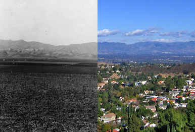

# Seeming Wasteland

### Setup

Open the `index.html` file in a browser. Feel free to edit both the
`main.js` file and `style.css` file to perform all of the actions below.

Write the changes in to their respective files, refreshing the page
after each action.

### Exercises

**Use JavaScript to manipulate the DOM and do the following:**

#### Part 1

1.  Create a `
` element, save it to a variable called `houseEl`,
    and give it a class of `dwelling`.
2.  Take this `
` (in the variable `houseEl`), and append it (as a 
    child) to the `<body>`.

#### Part 2

Check out [this][span-article] article for a second. It explains why the
`` tag is useful in HTML.

3.  Create the element `<h1>`, and save it to the variable 
    `topLevelHeaderEl`.
4.  Create the element ``, and save it to the variable `spanEl`.
    Then:
    - give the `spanEl` the text content of **"Seeming Wasteland"**;
    - give the `spanEl` the class of `shadowed`.
5.  Append `spanEl` to the `topLevelHeaderEl`.
6.  Append the `topLevelHeaderEl` to the `<body>`.

#### Part 3

7.  Create a new `
` element and save it to the variable `waldoEl`.
8.  Give this `
` (in the variable `waldoEl`) an `id` of `waldo`.
9.  Append the `
` (in the variable `waldoEl`) to the `<body>`.

#### Part 4

10. Create a `<ul>` element and save it to a *sensibly named variable*.
11. Iterate through the `birds` array in `main.js`, and create 
    an `<li>` for each bird. Give each `<li>`
    - a class of `bird`, and 
    - the text content of the bird's name.

    Finally, append the `<li>` to the `<ul>` you created.

12. Append the `<ul>` to the `<body>`.

#### Part 5

13. Add 5 more elements (using tags like ``, `
`, `
`, etc.) 
    to the DOM so that this seeming wasteland becomes lush. Feel free to
    get creative with the CSS in either `style.css` or in `main.js`.
14. Once the wasteland is no longer a wasteland, change the span tag
    (in the variable `span`) to have the text content **"Teeming Funland"**.

<!-- LINKS -->

[span-article]: http://www.sitepoint.com/web-foundations/span-html-element
